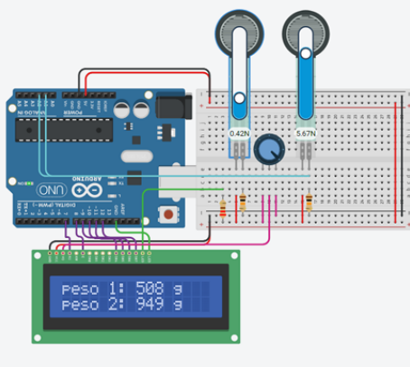

# 🥦 U-Phood — Estoque de Alimentos Automatizado com IoT

U-Phood é um sistema integrado de gerenciamento de alimentos que conecta um aplicativo móvel, uma aplicação web e um protótipo físico baseado em Arduino com sensores, oferecendo uma solução prática para o controle de estoque doméstico, com foco na redução de desperdícios e automação da rotina.

---

## 📖 Sobre o Projeto

Com a correria do dia a dia, manter o controle do que temos na geladeira ou na despensa pode ser um desafio. Estudos apontam que quase metade dos brasileiros joga comida fora diariamente, muitas vezes por puro esquecimento.

Pensando nisso, o U-Phood surgiu como uma solução inteligente para ajudar pessoas com rotinas atarefadas a automatizarem o gerenciamento de seus alimentos, evitando o desperdício e proporcionando maior praticidade no cotidiano.

---

## 🎯 Funcionalidades

- 📦 Controle de estoque em tempo real
- ⏰ Alertas de vencimento
- 🔐 Autenticação e gerenciamento de contas
- 📱 Interface mobile amigável
- 🌐 Aplicação web com suporte ao usuário
- ⚙️ Integração com sensores físicos via Arduino
- 🧠 Tela de dicas e ajuda ao usuário

---

## 🧩 Arquitetura do Sistema

O U-Phood é dividido em três camadas principais:

1. **Aplicativo Mobile (Front-end)**: Responsável pela interação com o usuário, gerenciamento do estoque, alertas e configurações.
2. **Hardware IoT (Arduino + Sensores)**: Detecta o peso dos alimentos armazenados em recipientes e envia os dados via Wi-Fi.
3. **Backend com Firebase**: Gerencia autenticação, dados dos usuários e sincronização entre app e dispositivos.
  
> 

---

## 🔌 Aplicação Física

O hardware foi desenvolvido com base no conceito de **hardware livre**, utilizando a plataforma **Tinkercad** para prototipagem. O sistema conta com sensores de carga que identificam o peso dos alimentos e enviam essas informações para o app por meio de um microcontrolador com conexão à internet.

> 📸 _[Imagem do protótipo e montagem no Tinkercad]_  
> ``

---

## 📱 Aplicativo Mobile

A versão mobile foi projetada para oferecer:

- Cadastro e login com autenticação segura
- Visualização e atualização do estoque
- Alertas automáticos de validade
- Acesso rápido à central de dúvidas

> 📸 _[Screenshots do app em funcionamento]_  
> ``

---

## 💻 Aplicação Web

A aplicação web permite que os usuários entrem em contato com a equipe de suporte por meio de um formulário integrado ao backend via PHP, enviando as mensagens diretamente para o e-mail oficial do projeto.

> 📸 _[Imagem da interface web]_  
> ``

---

## 🔐 Segurança e Autenticação

Utilizamos o **Google Firebase** como banco de dados e provedor de autenticação. O sistema garante:

- Criação e autenticação de contas por e-mail
- Troca de senha com verificação
- Regras de acesso personalizadas para segurança dos dados

> 📸 _[Painel do Firebase e telas de autenticação]_  
> ``

---

## 🧠 Experiência do Usuário

Realizamos testes com usuários reais e coletas de feedback sobre:

- Intuitividade da interface
- Facilidade no uso das funções
- Conectividade entre o app e o hardware

O app conta ainda com uma **tela de dicas permanente** na barra de navegação, funcionando como um guia rápido para novos usuários.

> 📸 _[Print da tela de dicas]_  
> ``

---

## 🌐 IoT e Conectividade

Para simular e validar a conectividade do projeto, utilizamos o **Cisco Packet Tracer**, modelando cenários de rede para ilustrar a comunicação entre os dispositivos e o servidor.

> 📸 _[Diagrama de rede no Cisco Packet Tracer]_  
> ``

---

## 🧮 Modelagem de Dados

A estrutura de dados foi modelada a partir de diagramas MER e DER, visando organização lógica das informações e facilidade de escalabilidade.

> 📸 _[Imagens dos diagramas]_  
> ``  
> ``

---

## 👥 Público-Alvo

O U-Phood foi pensado para pessoas que já utilizam soluções tecnológicas no seu dia a dia — usuários que adotam assistentes como a Alexa, automações residenciais e que valorizam a conveniência da tecnologia.

---

## ✅ Conclusão

O U-Phood representa uma solução real para um problema cotidiano, conectando software, hardware e internet para tornar a gestão doméstica mais eficiente, automatizada e sustentável.

---

## 👨‍💻 Equipe

- Arthur Jacintho de Oliveira Santos  
- Julia [Sobrenome]  
- Victor [Sobrenome]  
- Eduardo [Sobrenome]

---

## 📄 Licença

Projeto acadêmico sem fins lucrativos, desenvolvido como atividade final do curso técnico em Desenvolvimento de Sistemas.

